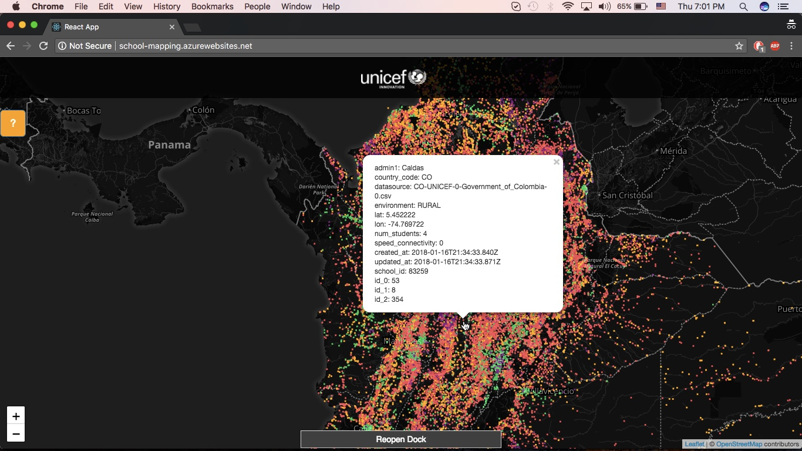
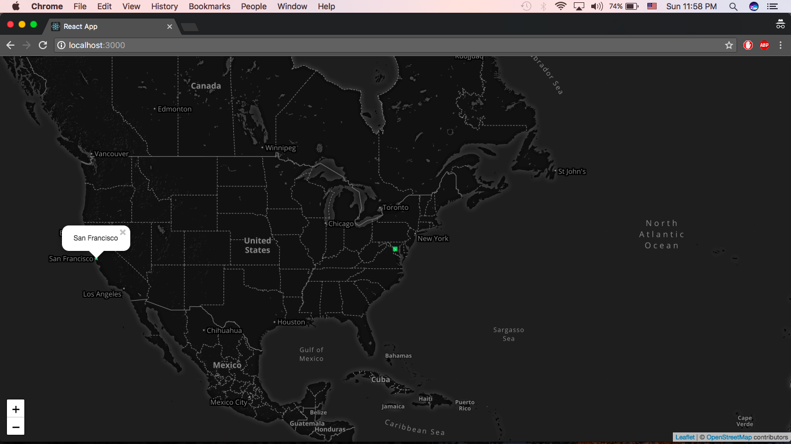

### Deprecation notice

This repository is now deprecated. It's higly recommended to use [mapbox-gl]([mapbox-gl](https://github.com/mapbox/mapbox-gl-js)) instead.

# react-webgl-leaflet

This react component can technically render over [16M clickable points](https://stackoverflow.com/questions/16830824/google-maps-using-three-js-and-webgl/27653983#27653983), though we haven't tested that many yet.

Most of the code and inspiration was taken from other places:
- [Brendan Kenny's Google Maps + HTML5 + Spatial Data Visualization](https://www.youtube.com/watch?v=aZJnI6hxr-c)
- [Pedro's tech mumblings: Displaying WebGL data on Google Maps](http://build-failed.blogspot.com/2013/02/displaying-webgl-data-on-google-maps.html)
- [webgl polygons fill with libtess js](https://blog.sumbera.com/2014/07/28/webgl-polygons-fill-with-libtess-js/)
- [Draw a lot of polygons fast](https://github.com/sniok/react-leaflet-webgl)

[Demo](http://school-mapping.azurewebsites.net)


## The ReactWebglLeaflet component takes two inputs
- A geojson object with an array of features of type point.
- A callback 
````
import React, { Component } from 'react';
import ReactWebglLeaflet from 'react-webgl-leaflet'
import {
  Map,
  TileLayer
} from 'react-leaflet'

class App extends Component {
  constructor(props) {
    super(props);
    this.state = {
      url: 'https://api.tiles.mapbox.com/v4/mapbox.dark/{z}/{x}/{y}.png?' +
        'access_token=' +
        'pk.your_mapbox_key.',
      attribution: '&copy; <a href=\'http://osm.org/copyright\'>OpenStreetMap</a>' +
        ' contributors ',
      position: [0, 0],
      zoom: 4
    }
  }
  render() {
    const pointClick = (feature, map) => {
      setTimeout(function() {
        map.openPopup(feature.properties.title,
          [
            feature.geometry.coordinates[1],
            feature.geometry.coordinates[0]
          ]
        )
      }, 300)
    }

    let geojson = {
      'type': 'FeatureCollection',
      'features': [{
                    "type": "Feature",
                    "geometry": {
                        "type": "Point",
                        "coordinates": [-77.03238901390978, 38.913188059745586]
                    },
                    "properties": {
                        "title": "Washington DC",
                        id: 2,
                        size: 5,
                        color: [92, 184, 92],
                        "icon": "monument"
                    }
                  }, {
                          "type": "Feature",
                          "geometry": {
                              "type": "Point",
                              "coordinates": [-122.414, 37.776]
                          },
                          "properties": {
                            "title": "San Francisco",
                            id: 3,
                            size: 3,
                            color: [92, 184, 92]
                          }
                      }]
    }

    const position = [38.913188059745586, -77.03238901390978]

    return (
        <Map
          center={position}
          zoom={this.state.zoom}
          zoomControl={false}>
          <ZoomControl position='bottomleft' />
          <TileLayer
            url={this.state.url}
            attribution={this.state.attribution}
          />
          <ReactWebglLeaflet
            points={geojson}
            onClickCallback={pointClick}
          />
        </Map>
    )
  }
}
export default App;
````

### The example
You need to get a mapbox token which I *think* can be gotten [here](https://www.mapbox.com/help/define-access-token/). You can also switch mapbox for open street maps tiles.

Only two points are displayed because we wanted all the code in a single file. However, you should be able to load a geojson object with millions of points.

If you add your mapbox token to the config file, then this is what you should see:


Otherwise you might see a blank page


### Caveat
We get this pesky warning. Any advice on it appreciated:
````
index.js:2178 Warning: Failed context type: Invalid context `map` of type `NewClass` supplied to `ReactWebglLeaflet`, expected instance of `NewClass`.
    in ReactWebglLeaflet (at App.js:79)
    in div (created by Map)
    in Map (at App.js:70)
    in App (at index.js:7)
````
